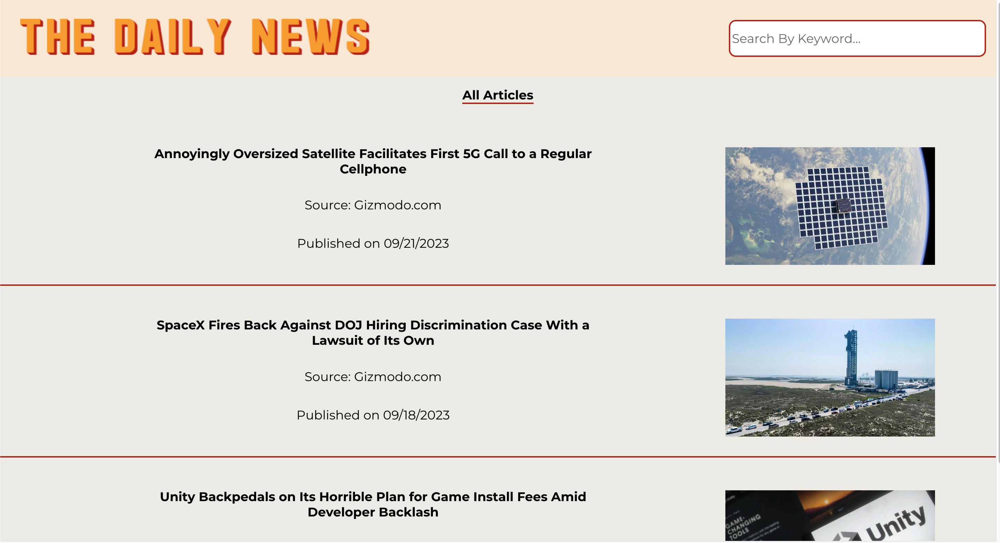
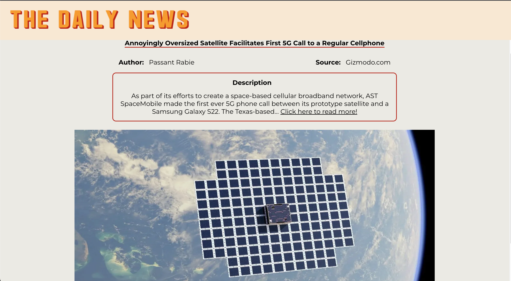
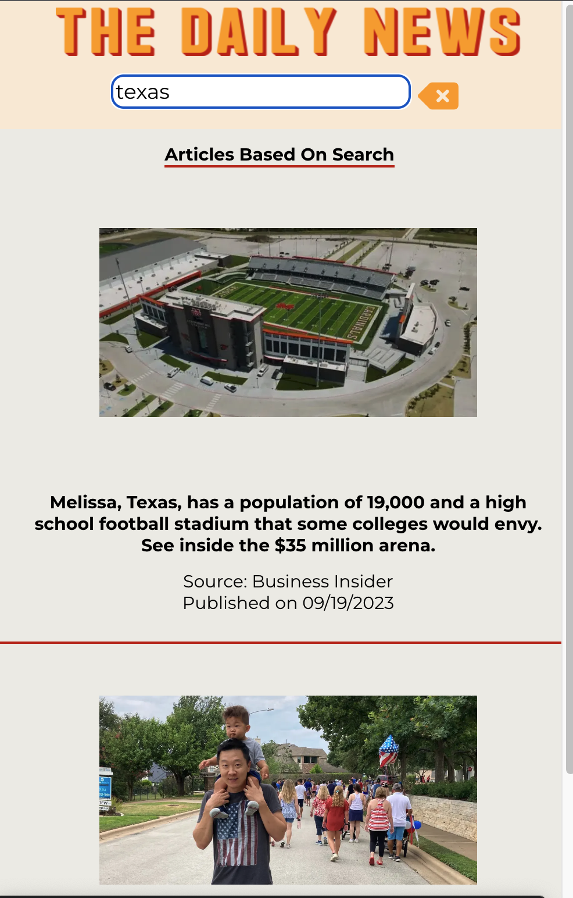

<h1> The Daily News</h1>

Technologies used: 
  
  
  
  
  

## Abstract: 
The Daily News is an app that allows you to browse current events. The user is able to search articles by keyword and select an article to see more details about it. The user is able to navigate to the original source of the article. The app is responsive to mobile and tablet sized devices.

# Preview of App:
 
 
  
  
  
 

## Installation Instructions:
- Clone the SSH key to your local machine using the command: `git clone git@github.com:fernandorobles97/daily-news.git`.
- Run the command: `cd daily-news`
- Run the command: `npm install`
- Run the command: `npm start`

## Context:
- I am currently enrolled in the seven month long Front End Engineering program at Turing School of Software and Design. This project was created within an 8 hour time frame.

## Contributors:
- [Fernando Robles](https://github.com/fernandorobles97)

## Learning Goals:
- Improving time management skills when working on a project with a shorter time frame
- Utilizing GitHub project board to stay on track for features and user stories 
Applying the core concepts of React
- Write DRY, reusable code that follows SRP and trends toward function purity
- Create a user interface that is easy to use and clearly displays information
